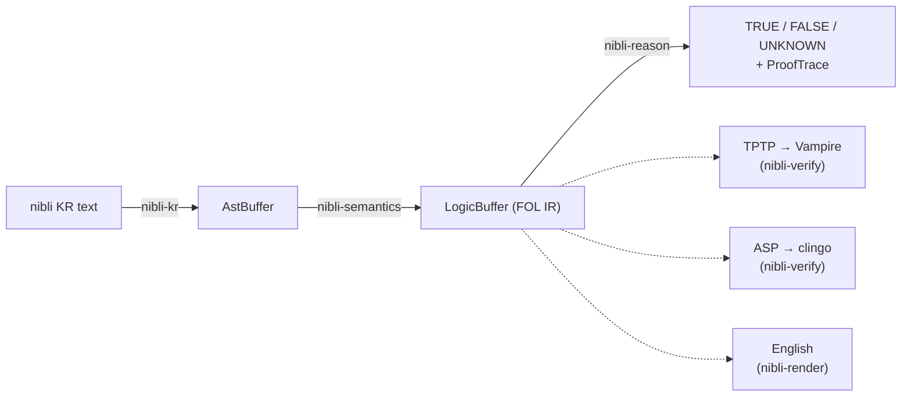

# Pipeline & logic IR

**Normative reference:**
[LOGIC_IR.md](https://github.com/dhilipsiva/nibli/blob/main/LOGIC_IR.md) at the
repo root — the public spec of the `LogicBuffer` IR. This page is the guided
tour; the spec wins on any disagreement. The single source of truth for the
types is `nibli-types/src/logic.rs`.

## The pipeline



The three stages are **plain Rust function calls** — `AstBuffer` never crosses
a WASM boundary, and `nibli-semantics` is an internal stage, not a component.
The one WASM boundary is host ↔ `nibli-pipeline`, and only `LogicBuffer`
(flat, `u32`-indexed, no pointers) crosses it. The `LogicBuffer` is the
**language-agnostic seam**: only `nibli-kr` (parser) and `nibli-lexicon`
(dictionary) are front-end-specific; the reasoner, both differential oracles,
and the Lean proofs operate on or below the IR.

Queries and assertions use the **same compiler** — there is no separate query
syntax at the IR level; divergence is entirely post-buffer. In particular,
`CountNode` and executable `ComputeNode` formulas are evaluated only by query
entry points when they occur in asserted position. Assertion and
preassigned/replay entry points reject those uses before mutation because the
store has neither a persistent cardinality-constraint representation nor a
durable compute-evidence lifecycle. Either node inside an opaque abstraction
body remains quoted content and is not evaluated against the outer KB.

### CoreSession — the one compile chain

`nibli_session::CoreSession` packages the chain
(`nibli_kr::parse_checked` → `nibli_semantics::compile_from_ast` →
`nibli_reason::transform_compute_nodes`) plus the compute-predicate registry
and the assert/query verbs. Every runtime surface — nibli-engine (native),
nibli-pipeline (WASM component), nibli-wasm and nibli-ui (browser) — wraps it
with only boundary conversion, so native↔WASM agreement holds **by
construction**. Per-surface policy (error conversion, lint notes, env reads,
persistence, compute-dispatch wiring) deliberately stays outside the core.
The ordering is contractual: corpus name/arity resolution completes before
compute marking. Registration is post-compile routing metadata for a
corpus-resolvable relation, not a vocabulary or arity declaration; converted
aliases and committed compounds normalize to their canonical IR relation.

## AstBuffer (internal interchange)

The parser's output and the semantic compiler's input: parallel `u32`-indexed
arrays (`predicates` / `arguments` / `sentences` / `roots`). It lives in
`nibli-types` (not nibli-kr) because it is also `nibli_kr::render`'s input
(the round-trip layer) and the validated programmatic-build target — hand-built
buffers pass `validate_ast_buffer` (index bounds, acyclicity, the `$`-sigil
invariant on variables) before compilation. Arguments are **typed**:
`Variable` (sigiled `$name`), `Marker` (`it` / `slot` / `?`), `Pronoun` (a
closed 14-variant inventory), plus names, descriptions, numbers — there is no
string-sniffed catch-all.

## LogicBuffer (the FOL IR)

Two fields, no version field:

```rust
pub struct LogicBuffer {
    pub nodes: Vec<LogicNode>,
    pub roots: Vec<u32>,   // top-level formula nodes
}
```

**13 `LogicNode` variants:** `Predicate`, `ComputeNode` (an atom dispatched to
the compute backend), `AndNode`, `OrNode`, `NotNode`, `ExistsNode`,
`ForAllNode`, `PastNode` / `PresentNode` / `FutureNode` (tense), 
`ObligatoryNode` / `PermittedNode` (deontic), `CountNode` (“exactly N”).
**5 `LogicalTerm` variants:** `Variable`, `Constant`, `Description`,
`Unspecified`, `Number(f64)`. Spec and code match one-for-one in name, payload,
and declaration order. Adding a variant is a breaking change across every
conversion site; an in-source guard (`__exhaustiveness_guard` in `logic.rs`)
forces that breakage to land in one documented location whose checklist names
each site to update — including the ones no compiler error reaches (the WIT
variant case + bindings regenerate, and the serde round-trip test).

Structural guarantees: **post-order layout** (children precede parents),
**DAG-not-tree** (the flattener shares subtrees; acyclicity is the producer's
responsibility — the reasoner bounds-checks, it does not cycle-validate), and
**root granularity = fact granularity** (`split_roots()` shares the whole node
arena, exposing one root per fact). One footgun is flagged in both spec and
code: `CountNode`'s middle field is a **count, not a node index** — the only
non-index `u32` payload in the IR.

There are deliberately **no `Biconditional`/`Xor` nodes**: the flattener
expands `A <-> B` and `A ⊕ B` into `And`/`Or`/`Not` shapes (sharing subtrees)
before the buffer exists.

## Emitted-shape invariants (the contract)

These shapes are contract, not accident — pinned by the seam-conformance gate
(`just verify-nibli-kr-seam`):

- **Neo-Davidsonian event decomposition.** `dog(Adam).` compiles to
  `∃ev. dog(ev) ∧ dog_x1(ev, adam) ∧ dog_x2(ev, Unspecified)` — a unary type
  predicate over a fresh event variable plus one binary role predicate per
  dictionary place (`dog` is arity-2: x2 is the breed), unfilled places padded
  with `Unspecified` so role predicates stay arity-consistent.
- **Quantifier shapes.** `some dog` → `Exists(v, And(restrictor, body))`;
  `every dog` → `ForAll(v, Or(Not(restrictor), body))` (the implication
  arrow); query-only `exactly N` → `CountNode`. Prenex `all $x: …` wraps the body
  **directly** — no restrictor, no arrow.
- **Flavor-exact ordinary-predicate rule literals.** `PastNode` / `PresentNode` / `FutureNode`
  remain attached to the antecedent or conclusion they wrap. Bare rule
  literals are Bare-only; the reasoner does not clone them into temporal
  flavors. A temporal mapping such as Past→Present therefore exists only when
  the KR rule declares both wrappers. Built-in identity and query-time compute
  dispatch keep their separately documented semantics. One formula path may
  carry one temporal or one deontic wrapper, never both: KR rejects mixed
  prefixes, AST compilation/rendering rejects dual-field propositions, and the
  reasoner rejects manually nested raw IR before assertion, query/find, proof
  construction, materialisation, or replay. Separate rule literals may still
  carry different wrappers.
- **Flat-atom families.** Not everything is event-decomposed: `equals` (the
  identity) stays a flat 2-argument atom (the union-find ingests exactly that
  shape); `via` modal tags, the `the_domain_<name>` restrictors, and the
  abstraction type predicates are also flat.
- **Abstraction opacity.** `event { P() }` bodies compile behind a
  versioned `__abs_v1_<digest>_<key>` marker. The tagged, length-delimited,
  alpha-canonical key contains abstraction kind + body and is the lossless
  identity; the digest is a non-semantic readable prefix recomputed from the key
  at every assert/query ingress. Malformed/unknown marker versions fail closed,
  and exact goldens freeze the v1 byte layout. The reasoner matches the complete
  marker but skips the body, so asserting
  `believe(me, fact { P })` never makes bare `P` true.
- **Compute transform.** The front-end never emits `ComputeNode`;
  `nibli_reason::transform_compute_nodes` rewrites marked `Predicate`s after
  fail-closed corpus compilation. The registry cannot make an unknown text name
  compile or supply its arity. A BYO-buffer producer may run the transform over
  its own exact IR-name set, or construct a raw `ComputeNode` directly; a compute
  relation left as a plain `Predicate` is treated as an ordinary fact.

`NotNode` is structurally plain ¬ — the closed-world reading is a *reasoner*
property, carried on the verdict side by `ProofTrace.naf_dependent` and
`ProofTrace.cwa_false`.

## Entry points

| You want | Use |
|----------|-----|
| Text → IR | `NibliEngine::compile_debug` / compile-only `NibliEngine::validate` (native), `compile-debug` (WIT), or `nibli_semantics::compile_from_ast` (+ `transform_compute_nodes`). These enforce corpus vocabulary and arity but do not check assertion admission; use `assert_text` for that boundary. Compute registration changes routing only after compilation |
| A programmatic ground fact | `CoreSession::assert_fact_direct` or `NibliEngine::assert_fact_direct` — decomposes and pads exactly like surface text, applies the live compute registry, and rejects registered compute — and the reference external names regardless of registration — as query-only. The lower-level compiler is `nibli_semantics::compile_injected_fact(relation, args)` |
| Reason over a buffer (BYO-IR) | Native `nibli_reason::KnowledgeBase`: `assert_fact`, `query_entailment[_with_proof]`, `query_find`, `count_witnesses`, `aggregate`, `with_assumptions`, `retract_fact`. An arbitrary compute relation is an explicit raw `ComputeNode`; its argument vector supplies the shape and it needs no text registration. Witness enumeration returns complete rows/counts or the incomplete-enumeration error when any final candidate leaf is non-definitive; `aggregate` inherits that refusal before its separate numeric projection, which still filters missing or nonnumeric bindings. `CountNode` and executable `ComputeNode` formulas in asserted position are query-only; run `validate_assertion` as structural preflight and use `assert_fact` for admission, while opaque quoted content remains inert |
| A packaged surface | `nibli_engine::NibliEngine` (native), the nibli-wasm `Session` (browser JS), or the `nibli-pipeline` component ([WIT surface](wit-surface.md)). The component currently has text-query methods only—no raw-buffer query or vocabulary/schema export—so a custom host import cannot add an arbitrary text name |

The reasoner's fact store remains a set keyed only by `StoredFact`; origin is a
separate structural support index. Every insertion records a direct assertion,
forward derivation with grounded premises, existential-import presupposition,
or explicit internal source. Rule citations use the full collision-safe rule
identity internally and expose the source assertion id plus deterministic local
ordinal. Rebuild/reopen regenerate both indexes from active LogicBuffers, so the
disposable typed mirror never becomes provenance authority.

## Stable vs internal

**Stable:** the 13+5 variant inventories (names, payloads, declaration order);
the two-field buffer; post-order layout; root granularity + `split_roots`;
the emitted-shape invariants; the `ProofRule`/`ProofStep`/`ProofTrace` JSON
contract; the `NibliError` display prefixes; the WIT `logic-types` interface.

**Internal:** variable/Skolem naming (`_v0`, `sk_N`), the exact versioned `__abs_` payload,
concrete index values, the compiler's tree IR (`IrForm`), stored-fact forms,
on-disk mirrors.

The buffer has no version field — the WIT package version
(`nibli:engine@0.12.0`) and nibli-store's fail-closed schema versions are the
only version markers. Treat the format as pre-1.0: pin a commit if you build
against it.

## Writing a consumer or producer

The two shipped external consumers are the templates:
`nibli-verify/src/tptp.rs` (→ Vampire; hard-errors on out-of-fragment nodes
rather than mistranslating) and `nibli-verify/src/asp.rs` (→ clingo; regroups
the event decomposition back to surface atoms). A producer must emit the
invariant shapes — most importantly the event decomposition with consistent
role arities, the ∀-implication arrow, and flat 2-arg `equals` — and gets
soundness checking for free: the reasoner rejects non-stratifiable rule sets
at assert time.
