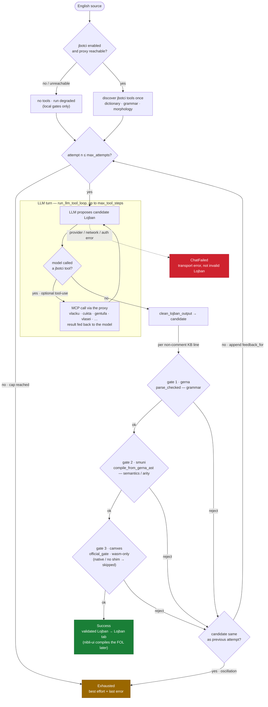

# nibli-fanva

The **agentic English→Lojban translator engine** for the Transparency Triad
(`fanva` = Lojban "translate"). An LLM translates; real Lojban compilers verify;
errors are fed back until the Lojban is valid. Surfaced inside `nibli-ui` as an
agentic "Translate" mode (this crate holds no UI).

## The loop

An LLM drafts Lojban and may call jbotci's dictionary/grammar tools *while
drafting*; every candidate must then clear a three-gate, fail-fast, **local**
firewall — gerna → smuni → camxes — before it is accepted. A rejection feeds the
compiler's own message back and the LLM retries, bounded by `max_attempts`. This
is the **translation** step (`agent::translate_agentic`): it runs before the
Lojban is shown, and is separate from the engine's own gerna→smuni→logji compile
that `nibli-ui` runs later, at query time.

Gate 1+2 are `gates::local_gates`. jbotci (`vlacku`/`cukta`/`tersmu`/`gentufa`)
is optional — reached only through an app-owned proxy — and is used as LLM tools
+ the tersmu meaning check, never as a required gate. No proxy ⇒ local gates
only, fully serverless.

## Verified upstream API (path deps within the workspace)

Confirmed against source (not assumed) — the standalone TODO's `⚠️ UNVERIFIED`
markers are resolved here:

| Symbol | Signature | Source |
|--------|-----------|--------|
| `gerna::parse_checked` | `(text: &str) -> Result<AstBuffer, NibliError>` | `gerna/src/lib.rs:104` |
| `smuni::compile_from_gerna_ast` | `(ast: AstBuffer) -> Result<LogicBuffer, NibliError>` | `smuni/src/lib.rs:345` |
| `NibliError` | enum `Syntax(SyntaxDetail{message,line,column})` \| `Semantic(String)` \| `Reasoning(String)` \| `Backend((String,String))`; `Syntax` Display = `"[Syntax Error] line L:C: msg"` | `nibli-types/src/error.rs` |
| `nibli_render::render_logic_buffer` | `(&LogicBuffer, Register::Spec) -> String` | used at `nibli-ui/src/main.rs:52` |
| `smuni_dictionary::back_translate` | `(&str) -> String` | used at `nibli-ui/src/main.rs:53` |

## Test discipline

- Local gates + provider/agent logic: native `cargo test -p nibli-fanva --lib`
  (with mocked `chat()` / MCP once those land).
- MCP client (gloo-net) + the camxes `official_gate` (JS-interop): wasm-only,
  covered by `wasm-pack test`.

See `TODO.md` for the phased backlog.
