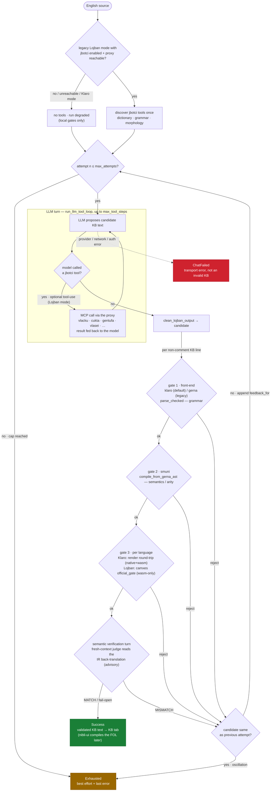

# nibli-fanva

The **agentic English→KB formalizer engine** for the Transparency Triad
(`fanva` = Lojban "translate" — the crate name predates THE FLIP). An LLM
formalizes English into the KB language (**Klaro** by default; legacy Lojban
behind the same `Language` seam); the real nibli compilers verify; errors are
fed back until the KB text is valid. Surfaced inside `nibli-ui` as the
**Formalize** mode (this crate holds no UI). "Formalize", never "compile": the
LLM step is interpretive and sits outside the reasoning firewall, behind the
deterministic gates below.

## The loop

An LLM drafts KB text — in legacy Lojban mode it may call jbotci's
dictionary/grammar tools *while drafting* — and every candidate must then clear
a three-gate, fail-fast, **local** firewall before it is accepted:

- **Klaro** (default): `klaro::parse_checked` (grammar + fail-closed name
  resolution) → `smuni` (semantics/arity) → the **render round-trip gate**
  (the candidate's canonical `klaro::render` re-spelling must re-compile to
  the SAME `LogicBuffer` — klaro's fixpoint contract as a per-candidate
  drift-catcher; pure Rust, runs native + wasm).
- **Lojban** (legacy): `gerna::parse_checked` → `smuni` → the official
  **camxes** parser (wasm-only JS-interop; skipped on native / without the
  shim).

A rejection feeds the compiler's own message back (`gates::feedback_for`) and
the LLM retries, bounded by `max_attempts` with an oscillation guard. A
gate-clean candidate then faces the **semantic verification turn**
(`verify.rs`): a fresh-context judge reads the engine's own IR-level
back-translation of each KB line and a MISMATCH retries through the same loop
— best-effort advisory, fail-open. This is the **formalization** step
(`agent::translate_agentic`): it runs before the KB text is shown, and is
separate from the engine's own front-end→smuni→logji compile that `nibli-ui`
runs later, at query time.

Gates 1–3 are `gates::local_gates` + `gates::validate`, all keyed on
`nibli_types::lang::Language`. jbotci (`vlacku`/`cukta`/`tersmu`/`gentufa`) is
**Lojban-only tooling**, optional even there — reached only through an
app-owned proxy — and used as LLM tools + the tersmu meaning view, never as a
required gate. No proxy (or Klaro mode) ⇒ local gates only, fully serverless.

## Test discipline

- Local gates (both languages, incl. the round-trip gate) + provider/agent
  logic + the verification turn: native `cargo test -p nibli-fanva --lib`
  (`just test-fanva`) with mocked `chat()` / MCP; the two shipped system
  prompts are pinned by gate-validity guard tests over their few-shots.
- MCP client (gloo-net) + the camxes `official_gate` (JS-interop): wasm-only,
  covered by `wasm-pack test` (`just test-fanva-wasm`).
